# OSF Builder Suite For Salesforce Commerce Cloud :: Deploy
Deploy your build to a Salesforce Commerce Cloud instance

**OSF Builder Suite For Salesforce Commerce Cloud :: Deploy** is an alternative to **Salesforce Commerce Cloud Build Suite** and is a very easy-to-use and highly configurable Jenkins plugin that is used to deploy your builds to your Salesforce Commerce Cloud continuous integration sandbox, development or staging instance. Being a native plugin for Jenkins and not a set of scripts it tightly integrates with it providing the best and easiest to use experience. You can make use of any existing Jenkins plugin (source code management, email notification, reports, etc.), configure it accordingly and use it.

**OSF Builder Suite For Salesforce Commerce Cloud :: Deploy** wants to be the first in a set of plugins that will make your life easier in regards to building your code and deploying it. We have a few ideas for what to build next, but we also take requests into account, so if you think of something you can let us know and we'll take it under consideration for a future plugin.

If you have a bug to report or maybe a feature that you wish to request, please do so [on the project's issues page](https://github.com/jenkinsci/osf-builder-suite-for-sfcc-deploy-plugin/issues).

# Features

- Simple. It does one thing, and it does it well.
- Easy to install, use and keep updated.
- Easy to configure. The plugin can be configured from the Jenkins web interface.
- Support for classical mode, Jenkins [Pipelines](https://jenkins.io/doc/book/pipeline/)and also the new modern [Blue Ocean](https://jenkins.io/doc/book/blueocean/) interface.
- Super flexible. Every little thing is configurable so that the plugin can be easily adjusted to your workflow.
- Integrated with the Jenkins [credentials plugin](https://plugins.jenkins.io/credentials) so that your credentials are safely stored encrypted.
- Support for two factor authentication
- Build info cartridge. A inf_build cartridge will be created as part of the build process that can be used to display information about the build number, version, when the build was made and who made it, in the storefront. This information can be displayed in the page source, title or by using the [OSF Builder Suite For Salesforce Commerce Cloud :: Deploy](https://chrome.google.com/webstore/detail/osf-builder-suite-for-sfc/epdbcbegecijepmdpnhogmedieghhbjj) plugin for Chrome.
- Support for builds bigger than 100MB. The build is split into multiple parts that are deployed one by one so you don't hit the 100MB upload quota limit that Salesforce Commerce Cloud has.
- Good documentation. Every option is documented both here on this page but also inline in Jenkins's UI by clicking the question mark icon next to the item for which you wish to display the help information.
- Support for HTTP proxy with basic or [NTLM](https://en.wikipedia.org/wiki/NT_LAN_Manager) authentication.
- Free
- Open source

# Installation

Just go to `Manage Jenkins > Manage Plugins > Available`, search for `OSF Builder Suite`, select `OSF Builder Suite For Salesforce Commerce Cloud :: Deploy` and click `Download now and install after restart` button.

# Configuration


Hostname of the SFCC instance where this build should be deployed. Examples:

|                                              |                                                                                   |
| -------------------------------------------: | :-------------------------------------------------------------------------------- |
| `cert.staging.realm.customer.demandware.net` | For deployments to a staging instance that has two factor auth enabled.           |
|      `staging-realm-customer.demandware.net` | For deployments to a staging instance that does not have two factor auth enabled. |
|  `development-realm-customer.demandware.net` | For deployments to a development instance.                                        |
|        `devNN-realm-customer.demandware.net` | For deployments to a sandbox instance.                                            |

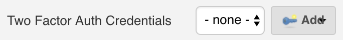

Two Factor Auth credentials of type `OSF Builder Suite :: Two Factor Auth Credentials` for the SFCC instance where this build should be deployed. Select `- none -` if you deploy to a instance that does not require two factor auth.

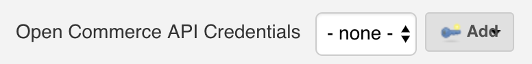

Open Commerce API credentials of type `OSF Builder Suite :: Open Commerce API Credentials` for the SFCC instance where this build should be deployed.

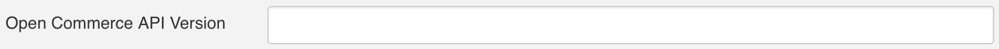

The version to be used by the calls made to OCAPI. The Open Commerce API Version starts with the character `v` (lowercase) followed by the actual version number, separated by an underscore.

For example: `v19_10`

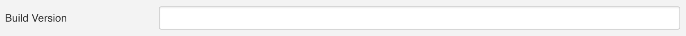

Name of the code version that is being deployed. This will be added as a suffix to the one generated by the builder.

Example: If you set it to dev then the code version will be `bN_YYYYMMDD_dev` with N the number of the current build, `YYYY` four digits year, `MM` two digits month, `DD` two digits day and dev at the end.


When this option is checked, a new cartridge named inf_build will be created. This cartridge can be used to display information about the build number, version, when the build was made and who made it, in the storefront.

This information can be displayed in the page source, title or by using the [OSF Builder Suite For Salesforce Commerce Cloud :: Deploy](https://chrome.google.com/webstore/detail/osf-builder-suite-for-sfc/epdbcbegecijepmdpnhogmedieghhbjj) plugin for Chrome.


When this option is checked, the build will also be activated after it was deployed. If left unchecked the build will only be deployed to the target instance without being activated.

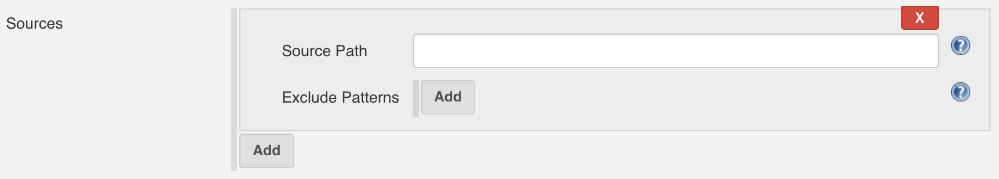

List of sources where the builder will look for cartridges in the form of a path (relative to the workspace) to a directory where the builder will look for cartridges.

Example: `scm/my-git-repo/cartridges`

You can also define a list of patterns to be ignored. If a path matches any of the patterns in this list then it will be ignored and not added to the build. The pattern needs to be relative to the source path defined above.

When a path is matched against a pattern, the following special characters can be used:

|      |                                                                 |
| ---: | --------------------------------------------------------------- |
|  `?` | Matches one character (any character except path separators)    |
|  `*` | Matches zero or more characters (not including path separators) |
| `**` | Matches zero or more path segments                              |

Examples:

|                        |                                                                                                                                  |
| ---------------------: | -------------------------------------------------------------------------------------------------------------------------------- |
|              `**/*.js` | Matches all .js files/dirs in a directory tree                                                                                   |
|      `node_modules/**` | Matches the node_modules folder and all its contents                                                                             |
|          `test/a??.js` | Matches all files/dirs which start with an a, then two more characters and then .js, in a directory called test                  |
|                   `**` | Matches everything in a directory tree                                                                                           |
|      `**/test/**/XYZ*` | Matches all files/dirs which start with XYZ and where there is a parent directory called test (e.g. abc/test/def/ghi/XYZ123)     |

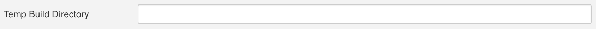

Path (relative to the workspace) to a temp directory, that will be used during the build. If the directory does not exist, it will be created by the builder and it will also be automatically cleaned up before each build.

Example: `tmp/code`

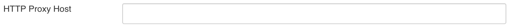

If your Jenkins server sits behind a firewall and does not have direct access to the internet, you can specify the HTTP proxy host in this field to allow Jenkins to connect to the internet trough it.

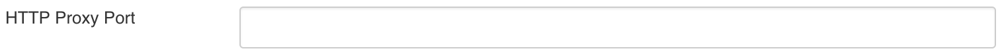

This field works in conjunction with the proxy host field to specify the HTTP proxy port.

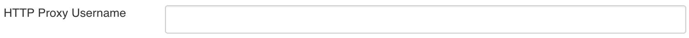

This field works in conjunction with the proxy host field to specify the username used to authenticate with the proxy.

If this proxy requires Microsoft's [NTLM](https://en.wikipedia.org/wiki/NT_LAN_Manager) authentication scheme then the domain name can be encoded within the username by prefixing the domain name followed by a back-slash `\` before the username, e.g `ACME\John Doe`.

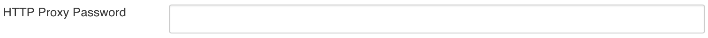

This field works in conjunction with the proxy host field to specify the HTTP proxy password.


When this option is checked, the builder will no longer validate the SSL certificate and hostname of the target instance.

**This has potential security implications so make sure you know what you are doing before enabling this option!**


# **Open Commerce API Settings**

Go to `Administration > Site Development > Open Commerce API Settings`, select type `Data`, select context `Global` and add following configuration:

```JSON
{
    "_v": "19.10",
    "clients": [
        {
            "client_id": "aaaaaaaaaaaaaaaaaaaaaaaaaaaaaa",
            "resources": [
                {
                    "resource_id": "/code_versions/*",
                    "methods": ["put", "patch"],
                    "read_attributes": "(**)",
                    "write_attributes": "(**)"
                },
                {
                    "resource_id": "/jobs/*/executions",
                    "methods": ["post"],
                    "read_attributes": "(**)",
                    "write_attributes": "(**)"
                },
                {
                    "resource_id": "/jobs/*/executions/*",
                    "methods": ["get"],
                    "read_attributes": "(**)",
                    "write_attributes": "(**)"
                }
            ]
        }
    ]
}
```

Go to `Administration > Organization > WebDAV Client Permissions` and add following configuration:

```JSON
{
    "clients": [
        {
            "client_id": "aaaaaaaaaaaaaaaaaaaaaaaaaaaaaa",
            "permissions": [
                {
                    "path": "/cartridges",
                    "operations": [
                        "read_write"
                    ]
                },
                {
                    "path": "/impex",
                    "operations": [
                        "read_write"
                    ]
                }
            ]
        }
    ]
}

```


# Jenkins Pipeline Configuration

Here's a sample pipeline configuration to get you started:

```Groovy
node {
    stage('Cleanup') {
        cleanWs()
    }

    stage('Git') {
        dir('scm/github.com/???/???') {
            git(
                branch: '???',
                credentialsId: '???',
                url: 'git@github.com:???/???.git'
            )
        }
    }

    stage('Yarn') {
        dir('scm/github.com/???/???') {
            nodejs('NodeJS v12') {
                sh('yarn install')
            }
        }
    }

    stage('Build') {
        dir('scm/github.com/???/???') {
            nodejs('NodeJS v12') {
                sh('yarn run webpack:prd')
            }
        }
    }

    stage('CodePush') {
        osfBuilderSuiteForSFCCDeploy(
            hostname: '???',
            tfCredentialsId: '???',
            ocCredentialsId: '???',
            ocVersion: 'v19_10',
            buildVersion: 'dev',
            sourcePaths: [[sourcePath: 'scm/github.com/???/???/cartridges']],
            activateBuild: true,
            createBuildInfoCartridge: true,
            tempDirectory: 'tmp/code'
        )
    }

    /* See https://plugins.jenkins.io/osf-builder-suite-for-sfcc-data-import
    stage('DataPush') {
        osfBuilderSuiteForSFCCDataImport(
            hostname: '???',
            tfCredentialsId: '???',
            ocCredentialsId: '???',
            ocVersion: 'v19_10',
            archiveName: 'metadata',
            sourcePath: 'scm/github.com/???/???/metadata',
            importStrategy: 'DELTA',
            tempDirectory: 'tmp/data'
        )
    }
    */
}
```

You can also always consult the pipelines documentation available at <https://jenkins.io/doc/book/pipeline/> or check the pipeline syntax link right inside Jenkins on the left navigation menu.

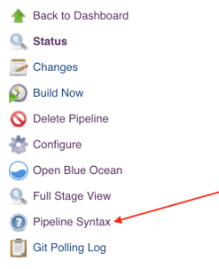

# Version history

<https://github.com/jenkinsci/osf-builder-suite-for-sfcc-deploy-plugin/releases>

# FAQ
* Q: Why am I getting the `InvalidHostHeaderException` while the plugin is making an OCAPI request?
* A: Go to `Administration >  Sites >  Manage Sites > Business Manager - Hostnames` and whitelist `cert.staging.???.???.demandware.net`.

# Dev
- `mvn hpi:run`
- `mvn clean package hpi:hpi`
- `mvn release:prepare release:perform`

